# Homelab Monitoring & Observability Stack


[](https://github.com/Racerx323/homelab-monitoring-observability/issues?q=is%3Aissue%20state%3Aopen)

A collection of configurations for a comprehensive monitoring and observability stack for your homelab. This repository provides a ready-to-use setup using Docker Compose, featuring Prometheus, Grafana, Alertmanager, and other exporters.

<!--- 
*(This is a placeholder. Add a screenshot of your actual dashboard to a `docs` folder and update the link!)* --->

## 📖 Table of Contents

- [Homelab Monitoring \& Observability Stack](#homelab-monitoring--observability-stack)
  - [📖 Table of Contents](#-table-of-contents)
  - [📍 About The Project](#-about-the-project)
  - [✨ Features](#-features)
  - [🏗️ The Stack \& Architecture](#️-the-stack--architecture)
    - [Architecture Overview](#architecture-overview)
  - [🚀 Getting Started](#-getting-started)
    - [Prerequisites](#prerequisites)
    - [Installation](#installation)
  - [🔧 Usage](#-usage)
    - [Accessing Services](#accessing-services)
    - [Customization](#customization)
      - [Adding a New Prometheus Target](#adding-a-new-prometheus-target)
      - [Adding a New Grafana Dashboard](#adding-a-new-grafana-dashboard)
  - [🤝 Contributing](#-contributing)
    - [Pull Request Process](#pull-request-process)
  - [📜 License](#-license)
  - [🙏 Acknowledgements](#-acknowledgements)

---

## 📍 About The Project

This project was born out of a desire to have a robust, easy-to-deploy monitoring solution for a personal homelab. The goal is to provide a solid foundation that you can easily extend and customize for your own environment. Whether you're running a single Raspberry Pi or a multi-node server cluster, this stack will help you keep an eye on your systems' health and performance.

We primarily use Prometheus for data collection and Grafana for visualization. This repository contains the configuration files (`prometheus.yml`, Grafana dashboard JSONs, `docker-compose.yml`, etc.) to get you up and running quickly.

## ✨ Features

- **Turnkey Setup:** Fully containerized with Docker and Docker Compose for a simple, one-command (`docker compose up`) launch.
- **Comprehensive Metrics:** Utilizes Prometheus to collect a wide range of metrics from industry-standard exporters, including:
  - **System Metrics:** CPU, memory, disk I/O, and network stats via `node-exporter`.
  - **Container Metrics:** Detailed resource usage for all Docker containers via `cAdvisor`.
- **Provisioned Dashboards:** Comes with pre-configured and customizable Grafana dashboards that are automatically provisioned on startup.
- **Advanced Alerting:** Leverages Alertmanager for powerful, flexible alerting with support for grouping, silencing, and routing to various notification channels (Slack, email, etc.).
- **Highly Extensible:** Designed to be easily extended. Add new scrape targets or exporters to monitor anything from a Pi-hole to a Kubernetes cluster.
- **Configuration as Code:** All configurations (`prometheus.yml`, `docker-compose.yml`, dashboards) are stored in the repository, enabling version control and easy replication of your setup.
- **Optional Munin Integration:** Includes configurations for Munin as a complementary tool, perfect for those who appreciate its simplicity and long-term RRD-based graphing.

## 🏗️ The Stack & Architecture

This monitoring solution is composed of several key components that work together in a containerized environment. Each plays a specific role in collecting, storing, and visualizing your data.

- **Prometheus:** The core of our stack. It's a powerful time-series database that *scrapes* (pulls) metrics from various exporters over HTTP, stores them efficiently, and supports a flexible query language (PromQL).
- **Grafana:** The premier visualization tool. It queries Prometheus for data and presents it in beautiful, interactive, and highly customizable dashboards.
- **Alertmanager:** Handles alerts sent by Prometheus. It takes care of deduplicating, grouping, and routing them to the correct receiver integrations like email, Slack, or PagerDuty.
- **cAdvisor:** An exporter from Google that provides resource usage and performance characteristics of running Docker containers. It's essential for understanding your containerized workloads.
- **Node Exporter:** The standard exporter for hardware and OS metrics exposed by *NIX kernels (CPU, memory, disk I/O, network stats, etc.).
- **Munin (Optional):** A classic and reliable networked resource monitoring tool. It operates on a master/node model and uses RRDtool to create simple, long-term graphs. It's included as an alternative or complement for those who appreciate its simplicity.

### Architecture Overview

The diagram below illustrates the flow of data. Exporters like `node-exporter` and `cAdvisor` run on your target machines (including the Docker host itself) and expose metrics. Prometheus is configured to periodically scrape these exporters. The collected data can then be queried and visualized in Grafana.

When a metric value crosses a configured threshold, Prometheus fires an alert to Alertmanager, which then routes a notification to your chosen channel. Munin, if enabled, operates in parallel, with its own master polling its own nodes.

```mermaid
graph TD
    subgraph User Interaction
        User[👨‍💻 User]
    end

    subgraph "Monitoring Stack (Docker Host)"
        P[Prometheus]
        G[Grafana]
        AM[Alertmanager]
        M[Munin Optional]
    end

    subgraph "Monitored Targets"
        NE["Node 1 (node-exporter)"]
        CAD["Docker Host (cAdvisor)"]
        Other["Other Services (e.g., Pi-hole exporter)"]
        MN["Munin Nodes (on various hosts)"]
    end

    subgraph "Notification Channels"
        Slack[Slack]
        Email[Email]
        Pushover[Pushover]
    end

    User -- "Views Dashboards" --> G
    User -- "Views Graphs" --> M

    G -- "Queries Metrics" --> P

    P -- "Scrapes Metrics" --> NE
    P -- "Scrapes Metrics" --> CAD
    P -- "Scrapes Metrics" --> Other

    M -- "Polls Data" --> MN

    P -- "Fires Alerts" --> AM

    AM -- "Routes Notifications" --> Slack
    AM -- "Routes Notifications" --> Email
    AM -- "Routes Notifications" --> Pushover
```



## 🚀 Getting Started

Follow these steps to get your own monitoring stack up and running in minutes.

### Prerequisites

Before you begin, ensure you have the following installed on your system:

- **Docker:** The container runtime.
- **Docker Compose:** The tool for defining and running multi-container Docker applications. Version 2.x (`docker compose`) is recommended.
- **`git`:** For cloning the repository.

### Installation

1. **Clone the Repository:**
    First, clone this repository to your local machine.

    ```sh
    git clone https://github.com/your-username/homelab-monitoring-observability.git
    cd homelab-monitoring-observability
    ```

    > [!NOTE]
    > The clone URL uses a placeholder `your-username`. Remember to replace this with the correct repository owner's username (`Racerx323`) or your own if you have forked it.

2. **Configure Environment Variables:**
    This project uses a `.env` file to manage sensitive information like passwords and user-specific settings. An example file is provided.

    ```sh
    # Create your own .env file from the example
    cp .env.example .env
    ```

    Now, open the `.env` file with your favorite editor. You **must** set a secure `GRAFANA_ADMIN_PASSWORD`. Review other variables and adjust them for your environment if needed.

3. **Launch the Stack:**
    Use Docker Compose to bring up all the services in the background.

    ```sh
    # For Docker Compose v2.x (recommended)
    docker compose up -d
    ```

    This command will pull the necessary Docker images and start all the services defined in the `docker-compose.yml` file.

4. **Verify the Installation:**
    Check that all containers are running correctly.

    ```sh
    docker compose ps
    ```

    You should see all services (`prometheus`, `grafana`, `alertmanager`, etc.) with a status of `running` or `up`. If you see any issues, you can check the logs for a specific service using `docker compose logs <service-name>`.

---

## 🔧 Usage

Once the containers are up and running, you can start exploring your new monitoring dashboard.

### Accessing Services

The services will be available on the following default ports of your Docker host. Replace `<your-docker-host-ip>` with the IP address of the machine where you are running the Docker containers.

> [!TIP]
> If you are accessing the services from the same machine they are running on, you can usually use `localhost` instead of `<your-docker-host-ip>`.

| Service          | URL                                     | Default Credentials                                               |
|------------------|-----------------------------------------|-------------------------------------------------------------------|
| **Grafana**      | `http://<your-docker-host-ip>:3000`     | **User:** `admin` <br> **Pass:** See `GRAFANA_ADMIN_PASSWORD` in `.env` |
| **Prometheus**   | `http://<your-docker-host-ip>:9090`     | N/A                                                               |
| **Alertmanager** | `http://<your-docker-host-ip>:9093`     | N/A                                                               |
| **Munin**        | `http://<your-docker-host-ip>:8080`     | N/A *(if enabled)*                                                |

After logging into Grafana for the first time, you will find pre-configured dashboards ready to visualize your system's metrics.

### Customization

#### Adding a New Prometheus Target

To monitor a new service (e.g., a web server, a database), you'll typically need to:

1. **Find and run an exporter:** Find an appropriate exporter for your service (a great place to look is the official exporters list) and run it on the target machine or as another Docker container.

2. **Add the target to Prometheus:** Add the exporter's address as a new scrape target in `prometheus/prometheus.yml`. It's good practice to add labels to help organize your metrics.

    For example, to add a new `node-exporter` running on a machine with IP `192.168.1.100`:

    ```yaml
    # In prometheus/prometheus.yml
    scrape_configs:
      # ... other jobs
      - job_name: 'node-exporter-new-server'
        static_configs:
          - targets: ['192.168.1.100:9100']
            labels:
              instance: 'my-new-server' # A friendly name for the target
    ```

3. **Reload the Prometheus configuration:** Instead of a full restart, you can tell Prometheus to reload its configuration gracefully without downtime.

    ```sh
    # For Docker Compose v2.x (recommended)
    docker compose kill -s HUP prometheus
    ```

    > [!TIP]
    > This sends a `HUP` signal to the Prometheus process, causing it to reload its configuration file. Alternatively, you can use the HTTP reload endpoint: `curl -X POST http://<your-docker-host-ip>:9090/-/reload`.

#### Adding a New Grafana Dashboard

This setup uses Grafana's provisioning feature. To add a new dashboard:

1. Find a dashboard on the Grafana Dashboards site or create your own.
2. Download the dashboard's JSON model.
3. Place the JSON file inside the `grafana/provisioning/dashboards/` directory.
4. Restart the Grafana container to apply the changes immediately.

    ```sh
    # For Docker Compose v2.x (recommended)
    docker compose restart grafana
    ```

    > [!NOTE]
    > By default, Grafana scans for new or changed dashboards in the provisioning directory every few minutes, so a restart may not be strictly necessary if you're willing to wait.

---

## 🤝 Contributing

Contributions are what make the open-source community such an amazing place to learn, inspire, and create. Any contributions you make are **greatly appreciated**.

If you have a suggestion that would make this better, please first check the [open issues](https://github.com/Racerx323/homelab-monitoring-observability/issues) to see if a similar idea has already been discussed. If not, feel free to open a new issue or submit a pull request. Don't forget to give the project a star! Thanks again!

### Pull Request Process

1. **Fork the Project**
2. **Create your Feature Branch:** Use a descriptive name.

    ```sh
    git checkout -b feat/add-plex-exporter
    ```

3. **Commit your Changes:** Write a clear, concise commit message.

    ```sh
    git commit -m 'feat: Add initial configuration for Plex exporter'
    ```

4. **Push to the Branch:**

    ```sh
    git push origin feat/add-plex-exporter
    ```

5. **Open a Pull Request:** Provide a clear title and description for your changes. Link to any relevant issues.

---

## 📜 License

Distributed under the GNU GPLv3 License. See `LICENSE.md` for more information.

---

## 🙏 Acknowledgements

This project stands on the shoulders of giants. A huge thank you to the developers and communities behind these amazing open-source tools that form the foundation of this stack:

- [**Prometheus**](https://prometheus.io/) - The core monitoring system and time-series database.
- [**Grafana**](https://grafana.com/) - For beautiful and powerful data visualization.
- [**Docker**](https://www.docker.com/) - For making this containerized setup possible and portable.
- [**cAdvisor**](https://github.com/google/cadvisor) - For providing container metrics.
- [**Node Exporter**](https://github.com/prometheus/node_exporter) - For exposing a wide variety of hardware and OS metrics.
- [**Munin**](https://munin-monitoring.org/) - The classic and reliable monitoring tool included as an option.

A special thanks to the countless developers of other exporters and the vibrant open-source community that makes projects like this possible.
